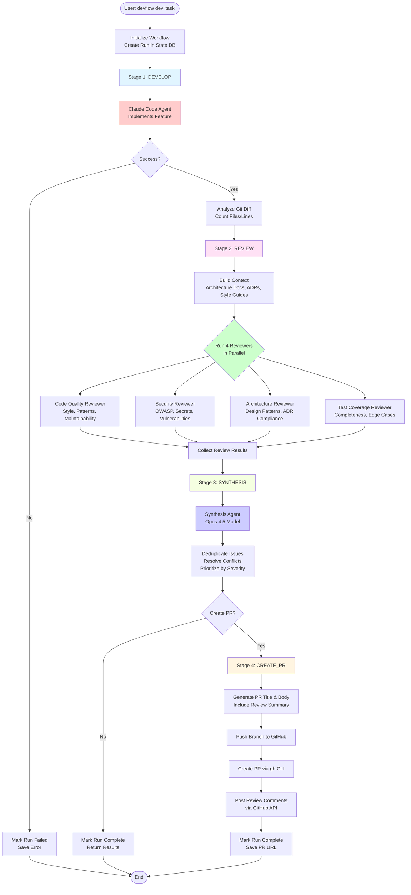
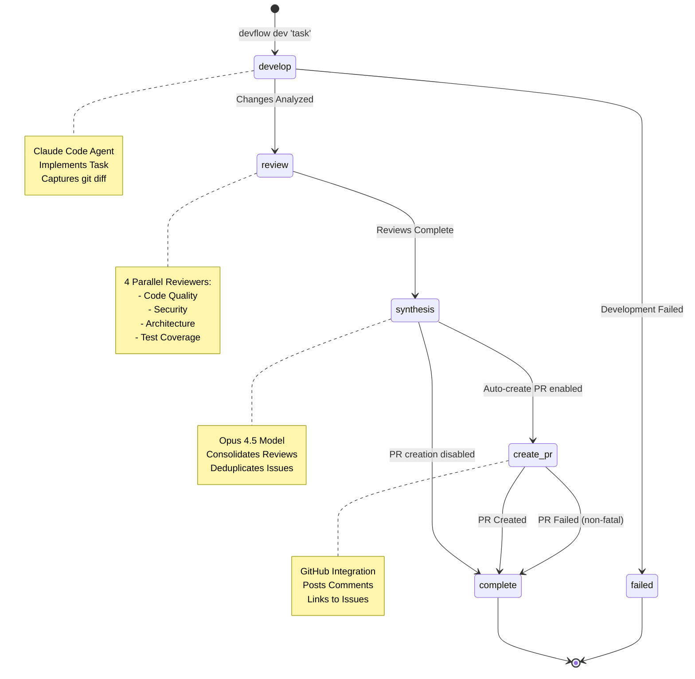
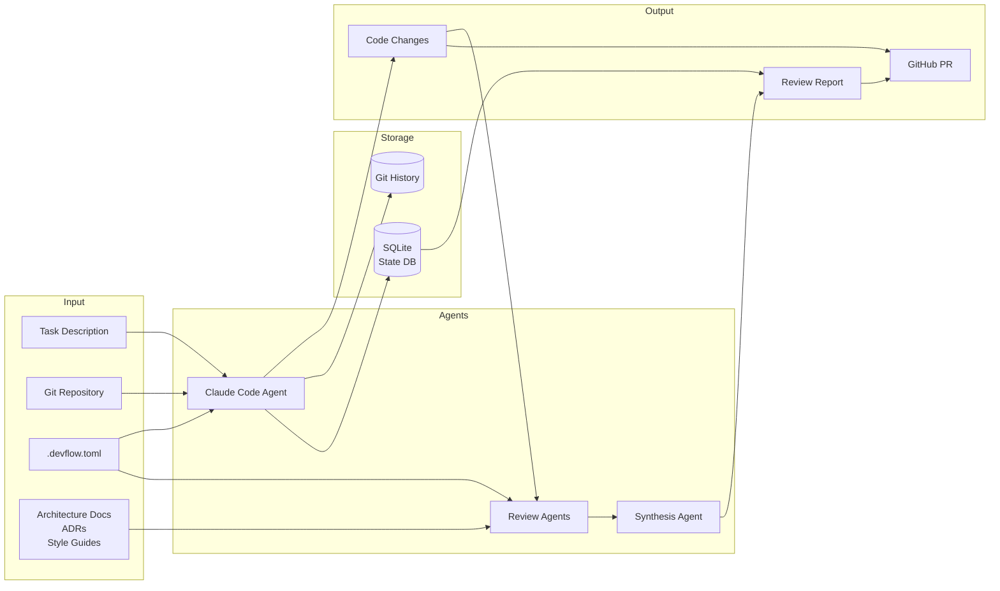

# Workflow Diagrams

## DevFlow Workflow (Software Development)

```mermaid
graph TB
    Start([User: devflow dev 'task']) --> Init[Initialize Workflow<br/>Create Run in State DB]

    Init --> Stage1[Stage 1: DEVELOP]

    Stage1 --> ClaudeCode[Claude Code Agent<br/>Implements Feature]
    ClaudeCode --> DevSuccess{Success?}
    DevSuccess -->|No| Failed1[Mark Run Failed<br/>Save Error]
    DevSuccess -->|Yes| AnalyzeChanges[Analyze Git Diff<br/>Count Files/Lines]

    AnalyzeChanges --> Stage2[Stage 2: REVIEW]

    Stage2 --> BuildContext[Build Context<br/>Architecture Docs, ADRs, Style Guides]
    BuildContext --> ParallelReviews{Run 4 Reviewers<br/>in Parallel}

    ParallelReviews --> CodeQuality[Code Quality Reviewer<br/>Style, Patterns, Maintainability]
    ParallelReviews --> Security[Security Reviewer<br/>OWASP, Secrets, Vulnerabilities]
    ParallelReviews --> Architecture[Architecture Reviewer<br/>Design Patterns, ADR Compliance]
    ParallelReviews --> TestCov[Test Coverage Reviewer<br/>Completeness, Edge Cases]

    CodeQuality --> CollectReviews[Collect Review Results]
    Security --> CollectReviews
    Architecture --> CollectReviews
    TestCov --> CollectReviews

    CollectReviews --> Stage3[Stage 3: SYNTHESIS]

    Stage3 --> SynthesisAgent[Synthesis Agent<br/>Opus 4.5 Model]
    SynthesisAgent --> Deduplicate[Deduplicate Issues<br/>Resolve Conflicts<br/>Prioritize by Severity]

    Deduplicate --> CreatePR{Create PR?}

    CreatePR -->|No| Complete1[Mark Run Complete<br/>Return Results]
    CreatePR -->|Yes| Stage4[Stage 4: CREATE_PR]

    Stage4 --> GeneratePR[Generate PR Title & Body<br/>Include Review Summary]
    GeneratePR --> PushBranch[Push Branch to GitHub]
    PushBranch --> CreateGitHubPR[Create PR via gh CLI]
    CreateGitHubPR --> PostComments[Post Review Comments<br/>via GitHub API]

    PostComments --> Complete2[Mark Run Complete<br/>Save PR URL]

    Failed1 --> End([End])
    Complete1 --> End
    Complete2 --> End

    style Stage1 fill:#e1f5ff
    style Stage2 fill:#ffe1f5
    style Stage3 fill:#f5ffe1
    style Stage4 fill:#fff5e1
    style ClaudeCode fill:#ffcccc
    style ParallelReviews fill:#ccffcc
    style SynthesisAgent fill:#ccccff
```

## DevFlow State Machine

```mermaid
stateDiagram-v2
    [*] --> develop: devflow dev 'task'

    develop --> failed: Development Failed
    develop --> review: Changes Analyzed

    review --> synthesis: Reviews Complete

    synthesis --> create_pr: Auto-create PR enabled
    synthesis --> complete: PR creation disabled

    create_pr --> complete: PR Created
    create_pr --> complete: PR Failed (non-fatal)

    complete --> [*]
    failed --> [*]

    note right of develop
        Claude Code Agent
        Implements Task
        Captures git diff
    end note

    note right of review
        4 Parallel Reviewers:
        - Code Quality
        - Security
        - Architecture
        - Test Coverage
    end note

    note right of synthesis
        Opus 4.5 Model
        Consolidates Reviews
        Deduplicates Issues
    end note

    note right of create_pr
        GitHub Integration
        Posts Comments
        Links to Issues
    end note
```

## DevFlow Data Flow

```mermaid
graph LR
    subgraph Input
        Task[Task Description]
        Repo[Git Repository]
        Config[.devflow.toml]
        Docs[Architecture Docs<br/>ADRs<br/>Style Guides]
    end

    subgraph Agents
        Claude[Claude Code Agent]
        Reviewers[Review Agents]
        Synthesis[Synthesis Agent]
    end

    subgraph Storage
        StateDB[(SQLite<br/>State DB)]
        GitHistory[(Git History)]
    end

    subgraph Output
        Changes[Code Changes]
        ReviewReport[Review Report]
        PR[GitHub PR]
    end

    Task --> Claude
    Repo --> Claude
    Config --> Claude

    Claude --> Changes
    Claude --> GitHistory
    Claude --> StateDB

    Changes --> Reviewers
    Docs --> Reviewers
    Config --> Reviewers

    Reviewers --> Synthesis

    Synthesis --> ReviewReport
    ReviewReport --> PR
    Changes --> PR

    StateDB --> ReviewReport
```
